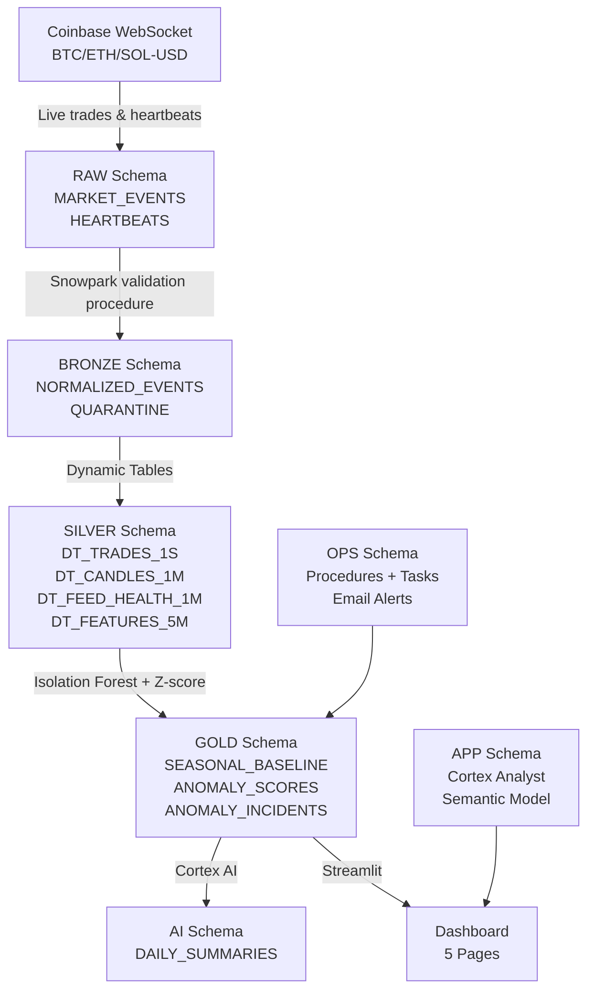
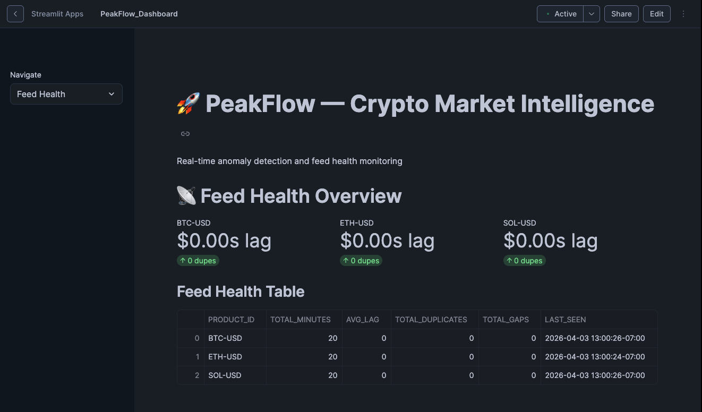
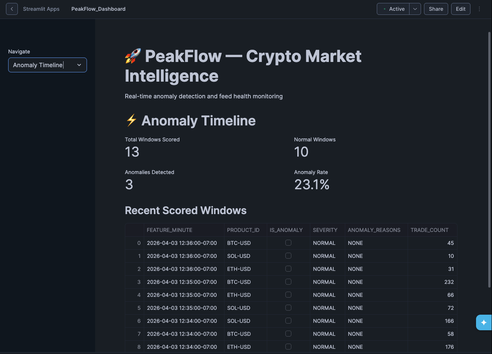
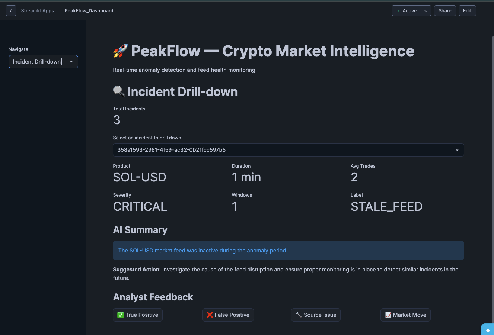
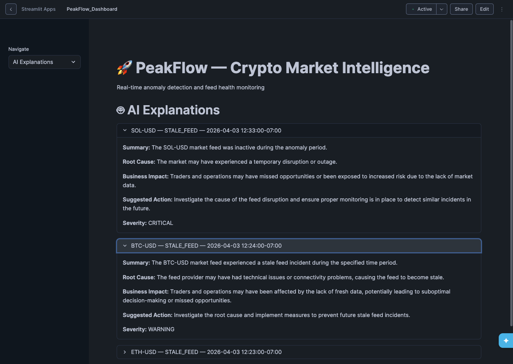
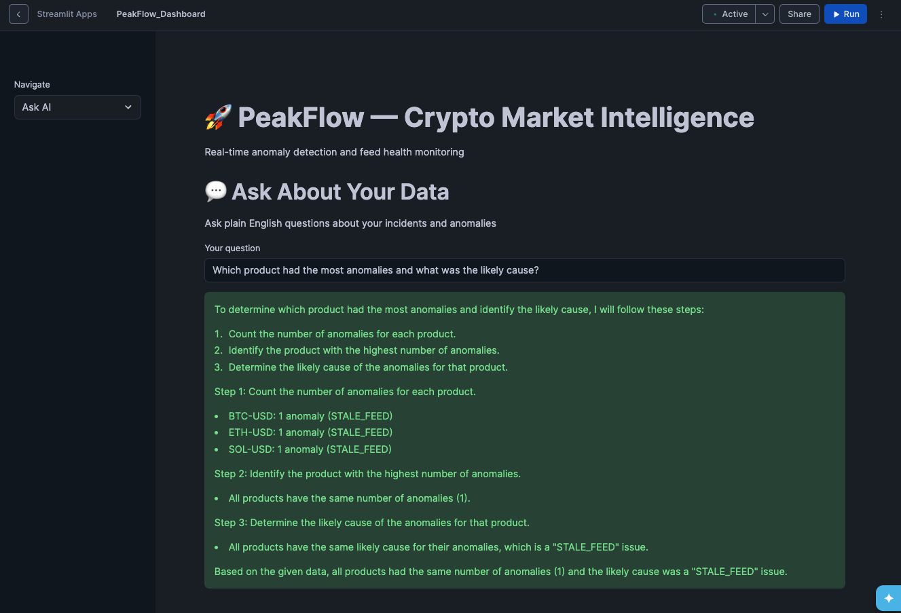

# 🚀 PeakFlow — Snowflake-Native Crypto Market Anomaly Detection

A production-grade, end-to-end data pipeline built entirely inside Snowflake that ingests live cryptocurrency market data, detects anomalies using machine learning, and surfaces AI-powered explanations through an interactive Streamlit dashboard.

---

## 🏗️ Architecture



---

## 📊 Dashboard

### Feed Health


### Anomaly Timeline


### Incident Drill-down


### AI Explanations


### Ask AI (Natural Language Query)


---

## 🔧 Tech Stack

| Layer | Technology |
|---|---|
| Cloud Data Platform | Snowflake |
| Data Ingestion | Python + Coinbase WebSocket API |
| Data Validation | Snowpark (Python) |
| Streaming Aggregation | Snowflake Dynamic Tables |
| Anomaly Detection | Isolation Forest + Z-score (Snowpark ML) |
| AI Explanations | Snowflake Cortex (snowflake-arctic) |
| Natural Language Queries | Cortex Analyst + Semantic Model |
| Email Alerts | Snowflake Alerts + Notification Integration |
| Dashboard | Streamlit in Snowflake |

---

## 📁 Project Structure

```
peakflow/
├── producer/
│   └── coinbase_producer.py      # Live WebSocket ingestion (BTC/ETH/SOL-USD)
├── screenshots/
│   ├── Feed_health.png
│   ├── Anomaly_timeline.png
│   ├── Incident_Drill_Down.png
│   ├── AI_Explanations.png
│   └── ASK_AI.png
├── peakflow_semantic_model.yaml  # Cortex Analyst semantic model
├── .gitignore
└── README.md
```

---

## 🗄️ Snowflake Schema Overview

### RAW
- `MARKET_EVENTS` — raw trade ticks from Coinbase WebSocket
- `HEARTBEATS` — feed health heartbeat events

### BRONZE
- `NORMALIZED_EVENTS` — validated, typed events (7,121 rows)
- `QUARANTINE` — rejected/malformed events

### SILVER (Dynamic Tables)
- `DT_TRADES_1S` — 1-second trade aggregations
- `DT_CANDLES_1M` — 1-minute OHLCV candles
- `DT_FEED_HEALTH_1M` — per-minute feed health metrics (lag, gaps, duplicates)
- `DT_FEATURES_5M` — 5-minute feature windows for ML scoring

### GOLD
- `SEASONAL_BASELINE` — historical baseline statistics per product/hour
- `ANOMALY_SCORES` — per-window anomaly scores with severity labels
- `ANOMALY_INCIDENTS` — grouped incidents with Cortex AI explanations

### OPS
- `VALIDATE_MARKET_EVENTS` — Snowpark validation procedure + scheduled task
- `SCORE_ANOMALIES` — anomaly scoring procedure
- `TRAIN_AND_SCORE_ISOLATION_FOREST` — ML training + inference
- `GROUP_INCIDENTS` — incident grouping logic
- `EXPLAIN_INCIDENTS` — Cortex AI explanation generation
- `GENERATE_DAILY_SUMMARY` — daily AI summary procedure
- `CRITICAL_INCIDENT_ALERT` — email alert for CRITICAL severity incidents

---

## 🚀 Setup & Running

### Prerequisites
- Snowflake account with Cortex enabled
- Python 3.11+
- Coinbase Advanced Trade API access

### Environment Variables
Create a `.env` file (never committed):
```
SNOWFLAKE_ACCOUNT=your_account
SNOWFLAKE_USER=your_user
SNOWFLAKE_PASSWORD=your_password
SNOWFLAKE_DATABASE=PEAKFLOW_DB
SNOWFLAKE_WAREHOUSE=PEAKFLOW_WH
```

### Start the Producer
```bash
cd ~/peakflow
python3 producer/coinbase_producer.py
```

### Snowflake Session Setup
Always run at the start of each session:
```sql
USE WAREHOUSE PEAKFLOW_WH;
ALTER WAREHOUSE COMPUTE_WH SUSPEND;
```

---

## 🤖 AI Features

### Cortex Analyst
Natural language querying of anomaly data using a custom semantic model (`peakflow_semantic_model.yaml`). Ask questions like:
- *"Which product had the most anomalies?"*
- *"What was the most common root cause?"*
- *"Show me all WARNING severity incidents"*

### Cortex AI Explanations
Each detected incident is automatically explained by Snowflake Cortex with:
- **Label** — incident classification (e.g. STALE_FEED, MARKET_MOVE)
- **Summary** — plain English description
- **Root Cause** — likely technical or market cause
- **Business Impact** — trading implications
- **Suggested Action** — recommended response

### Email Alerts
CRITICAL severity incidents trigger automatic email alerts via Snowflake Notification Integration.

---

## 📈 Results

| Metric | Value |
|---|---|
| Raw events ingested | 7,121 |
| Windows scored | 13 |
| Anomalies detected | 3 |
| Anomaly rate | 23.1% |
| Incidents grouped | 3 |
| Products monitored | BTC-USD, ETH-USD, SOL-USD |

---

## 👤 Author

**Shiva** — Built as a 15-day end-to-end Snowflake data engineering project.

[](https://github.com/shivzen-pixel)
